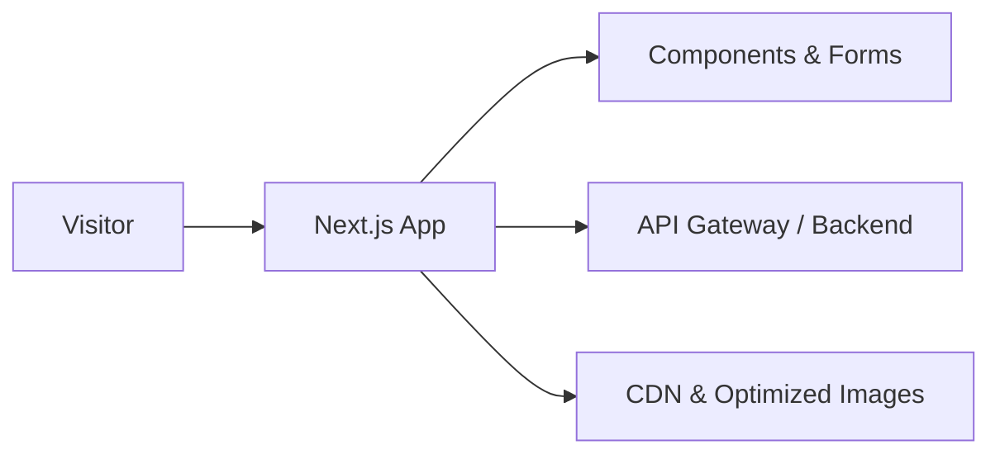

# Elevon Labs — Production SaaS Marketing Site & Quote System

Elevon Labs is a production-grade Next.js application that helps founders and modern service businesses move from “idea” to scoped execution. The site combines a marketing website with an interactive quote-and-milestone system that generates a launch-ready plan, pricing, and payment flow.

---

## Quick Impact & Ownership

- Sole frontend owner for architecture, interactivity, and integration with the backend API.
- Built an end-to-end quote and payment system from initial project inputs through invoice download.
- Designed mobile-first flows that guide founders from discovery to payment on a production domain.

---

## Live Product

- Live site: https://www.elevon-labs.com/
- Primary flows:
  - Browse services and positioning.
  - Use “Discover Your Project” to clarify scope, budget, and timeline.
  - Generate a tailored project quote.
  - Review and customize milestones and inclusions.
  - Pay a deposit and receive a downloadable invoice.

This repository reflects a live production system running on a public domain.

---

## Frontend Responsibilities

- Frontend architecture using Next.js App Router and TypeScript.
- Interactive multi-step quote generation experience.
- Milestone-based pricing customization engine.
- Dynamic invoice and PDF generation for quotes and payments.
- Payment flow with deposit/final breakdown and success state handling.
- Blog system with category routing and SEO-friendly URLs.
- Responsive, mobile-first design system using TailwindCSS and shadcn/ui.

---

## Tech Stack (At a Glance)

- Next.js (App Router)
- React + TypeScript
- TailwindCSS
- shadcn/ui + Radix
- React Hook Form + Zod
- TanStack Query
- Axios
- jsPDF and html2canvas
- Framer Motion

---

## Responsiveness and UX Strategy

- Mobile-first layout using Tailwind utility classes with progressive enhancement for larger screens.
- Shared components (buttons, inputs, modals, accordions, cards) built on shadcn/ui and Radix for accessibility.
- UX optimized for clarity: transparent timelines, explicit milestones, and predictable steps in complex flows.

---

## High-Level Architecture

- Visitor hits the Next.js app, which renders marketing pages and interactive flows.
- Components and forms manage client-side state and validation.
- All server interactions go through an API gateway.
- Static assets and images are served via CDN for fast delivery.
- Full component and state management details can be discussed during an interview.

---

## Core Product Flow: Quote → Review → Payment → Invoice

1. **Quote creation** – Multi-field form with Zod validation creates a quote via React Query mutation and returns a normalized quote with URL, base price, and totals.
2. **Review and customize** – User toggles addons/features; memoized helpers recalculate totals, timelines, and milestones; changes are persisted with a structured update mutation.
3. **Payment** – Payment page reloads the quote, derives inclusions and deposit/final amounts, enforces explicit agreement, and initializes a checkout session with the payment provider.
4. **Success and invoice** – After payment, the success page loads the updated quote, summarizes project and pricing, and lets the user download a styled PDF invoice.
5. **Real-world complexity** – Handles derived pricing, milestone recalculation, and payment state verification as part of the flow.

---

## Performance Strategy

- Image optimization with Next/Image and CDN-backed delivery.
- On-demand loading for jsPDF/html2canvas so non-PDF users aren’t penalized.
- Memoized derived values (totals, timelines, addon counts) to keep interactions snappy.
- Mobile-first Tailwind utilities so layouts adapt cleanly across breakpoints.
- Framer Motion used for lightweight, non-blocking transitions only.

---

## Admin Experience (High-Level)

- Includes an internal admin experience to inspect and manage quotes.
- Admin users can view structured quote records including pricing, addons, and metadata.
- Admin users can review milestone breakdowns and monitor payment state and quote status.
- Access is protected via an environment-provided password (`QUOTE_GENERATOR_ADMIN_PASSWORD`), not hard-coded in the repo.
- Designed for real operational use, not just demos.
- Handles real-world admin concerns like surfacing correct quote state and aligning it with payment outcomes.
- In an interview, I can walk through the admin flow live on the production site and explain how it shares the same quote infrastructure as public flows.

---

## Running the Project Locally (Optional)

Not required for recruiters, but included for completeness:

- Install dependencies with your preferred package manager.
- Set required environment variables.

### Required Environment Variables

- `NEXT_PUBLIC_SITE_BASE_URL` – public site URL.
- `NEXT_PUBLIC_CLOUDFRONT_BASE_URL` – CDN base URL for media assets.
- `NEXT_PUBLIC_API_GATEWAY_BASE_URL` – backend API gateway endpoint.
- `NEXT_PUBLIC_API_GATEWAY_API_KEY` – API key for authenticated API calls.
- `QUOTE_GENERATOR_ADMIN_PASSWORD` – password for the internal quote admin area.
- Start the dev server (for example: `npm run dev`) and open `http://localhost:3000`.

This repository demonstrates production-grade frontend architecture, from marketing site to guided discovery, scoped quotes, payment handling, and automated documentation delivery.
