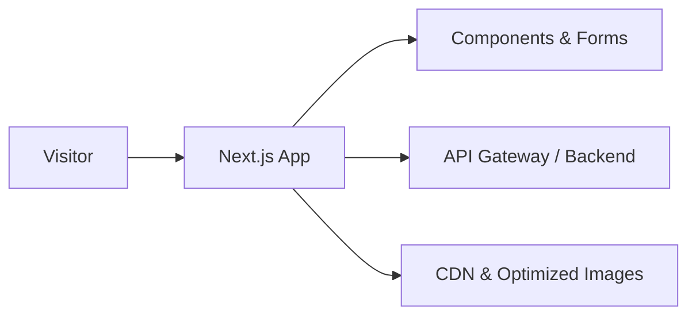

# Elevon Labs — Production SaaS Marketing Site & Quote System

Elevon Labs is a production-grade Next.js application that helps founders and modern service businesses move from idea to scoped execution.

It combines a marketing website with an interactive quote and milestone system that generates a launch-ready plan, pricing breakdown, and payment flow.

---

## 🚀 Impact & Ownership

- Sole frontend owner responsible for architecture, interactivity, and backend integration.
- Built a full quote → milestone → payment → invoice system with real-time pricing logic.
- Designed mobile-first product flows guiding founders from discovery to deposit payment.
- Integrated dynamic invoice generation and structured quote persistence.
- Implemented a structured pricing engine capable of dynamically recalculating project totals, timelines, and milestone breakdowns in real time.

---

## 🌐 Live Product

**Live site:** https://www.elevon-labs.com/

### Primary Flows

- Browse services and positioning
- Use **Discover Your Project** to define scope, budget, and timeline
- Generate a tailored project quote
- Review and customise milestones and add-ons
- Pay a deposit and receive a downloadable invoice

---

## 🛠 What I Built

- Next.js App Router architecture with TypeScript
- Multi-step quote generation with schema validation
- Milestone-based pricing customisation engine
- Real-time totals and timeline recalculation
- Structured quote persistence via API mutations
- Payment flow with deposit/final breakdown
- Dynamic PDF invoice generation
- Blog system with SEO-friendly routing
- Mobile-first responsive design system

---

## 🧱 Tech Stack

- Next.js (App Router)
- React + TypeScript
- TailwindCSS
- shadcn/ui + Radix
- React Hook Form + Zod
- TanStack Query
- Axios
- jsPDF + html2canvas (loaded on demand)
- Framer Motion

---

## 🏗 High-Level Architecture



- Client renders marketing pages and interactive flows.
- Forms manage client-side state and validation.
- Server communication handled through API gateway.
- CDN-backed assets and image optimisation for performance.

---

## 🧠 Architectural Focus

This project demonstrates:

- Complex multi-step state orchestration
- Derived pricing calculations with memoisation
- API mutation normalisation patterns
- Real-world payment state handling
- Production-focused UX decisions

---

## 🔄 Core Product Flow

### 1. Quote Creation
- Multi-field form with schema validation
- React Query mutation creates a structured quote
- Returns base price, URL slug, and pricing totals

### 2. Review & Customize
- Toggle add-ons and features
- Memoised recalculation of totals, timelines, milestones
- Structured update mutations persist changes

### 3. Payment
- Reloads normalised quote data
- Calculates deposit and final balance
- Enforces agreement confirmation
- Initialises checkout session

### 4. Success & Invoice
- Fetches updated quote post-payment
- Displays full pricing summary
- Generates a downloadable, styled PDF invoice

---

## ⚡ Performance Strategy

- Next/Image optimisation with CDN-backed delivery
- On-demand loading for PDF libraries
- Memoised derived calculations for responsive UI
- Mobile-first Tailwind layout system
- Lightweight animation with Framer Motion

---

## 🔐 Admin Experience (High-Level)

- Internal admin interface for inspecting and managing quotes
- Access protected via environment variable (`QUOTE_GENERATOR_ADMIN_PASSWORD`)
- Shares the same quote infrastructure as public flows

---

## 📱 UX & Responsiveness

- Mobile-first layout with progressive enhancement
- Shared accessible components built on shadcn/ui and Radix
- Clear multi-step flows for complex pricing interactions

---

## 🖥 Running Locally (Optional)

```bash
npm install
npm run dev
```

### Required Environment Variables

- Site URL
- CDN configuration
- API gateway endpoint
- Admin password

Then open:

```
http://localhost:3000
```

---

## 🎯 Project Goal

This repository demonstrates intentional system design:

From marketing and guided discovery  
→ to scope quote generation  
→ to structured milestone planning  
→ to payment handling  
→ to automate documentation delivery  

A production-oriented frontend architecture focused on real user flows, performance, and clarity.
